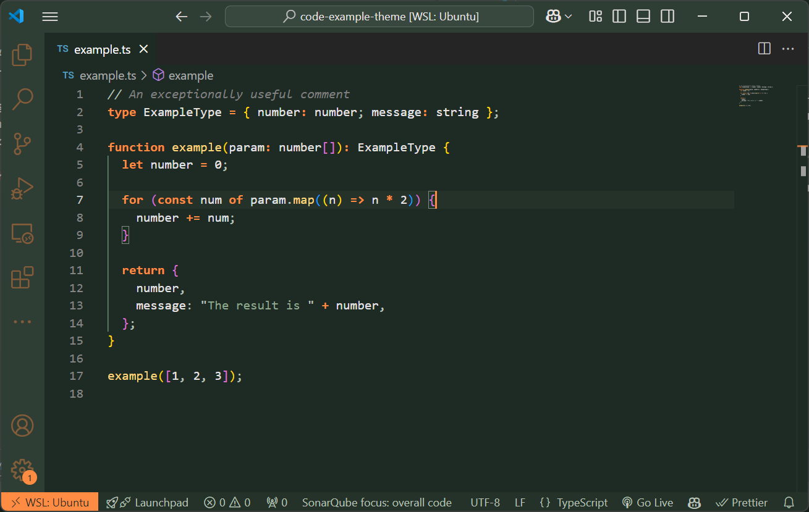

# **Steambot Theme** 🌿⚙️

**A steampunk-inspired dark theme blending nature and machinery.**

Steambot Theme is designed for developers who enjoy a **unique, atmospheric coding experience**. Inspired by overgrown, rusted machines in deep forests, this theme combines **warm metal tones, deep greens, and soft highlights** to create an immersive and eye-friendly workspace.

## **✨ Features:**

- 🟢 **Balanced Contrast** – A dark background with warm highlights for readability.
- 🔧 **Steampunk Aesthetic** – A fusion of nature and machinery, inspired by rust, moss, and old gears.
- 🎨 **Distinct Syntax Highlighting** – Clear differentiation between keywords, variables, functions, and comments.
- 🌙 **Eye Comfort** – Reduced eye strain with natural, earthy tones.

🚀 **Give your VS Code a fresh, adventurous look with Steambot Theme!**
